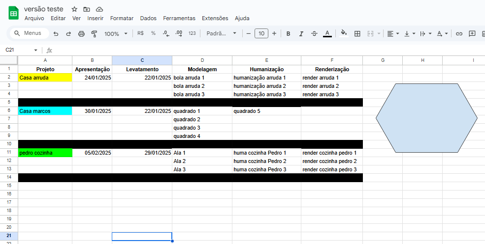

# Gestor de Tarefas e Agenda Google

Este projeto utiliza Google Apps Script na planilha do Google para automatizar a criação e organização de tarefas e eventos no Google Tasks e Google Agenda com base em projetos e prazos definidos.

## Funcionalidades

- **Criação automática de agendas no Google Agenda**, com eventos de dia inteiro para cada tarefa de um projeto.
- **Criação automática de listas no Google Tasks**, com tarefas separadas por projeto e com prazos definidos.
- **Distribuição inteligente de tarefas** ao longo do tempo, de acordo com os prazos de cada projeto.
- **Separação clara entre eventos e tarefas**, evitando duplicidade de informações.

## Estrutura do Projeto

- `Código.gs`: Arquivo principal do projeto.
- `extrairProjetos.gs`: Contém funções para extrair e preparar os dados dos projetos.
- `distribuirTarefasEmDias.gs`: Responsável por distribuir as tarefas ao longo dos dias até o prazo.
- `preencherCalendario.gs`: Cria eventos no Google Agenda.
- `preencherTarefas.gs`: Cria tarefas no Google Tasks.
- `Util.gs`: Funções utilitárias usadas em múltiplas partes do projeto.

## Como usar

1. Acesse o google planilhas crie um novo projeto.

2. **Você deve configurar sua planilha da seguinte forma:**  
  
Da coluna A até a F são as entradas de dados e a linha preta demarca o final daquele projeto.\
   \- A (Projeto) deve conter a cor e nome do projeto.\
   \- B (Apresentação) data de entrega do projeto.\
   \- C (Levantamento) data de início.\
   \- D,E e F Local onde as partes do projeto estão separadas.

3. **Cole os arquivos acima** no seu projeto do Apps Script.(em extensões)

4. **Aperte o botão**.

5. **Na primeira vez que utilizar a aplicação, aceite as permissões do Google.**

6. **Após aceitar as permissões, a aplicação estará pronta para uso.**

7. **Agora basta abrir o seu google agenda**.

## Pré-requisitos

- Conta Google com acesso ao Google Agenda e Google Tasks.
- Permissão para execução de scripts no Apps Script.

## Autor

Desenvolvido por Pedro Artur.

